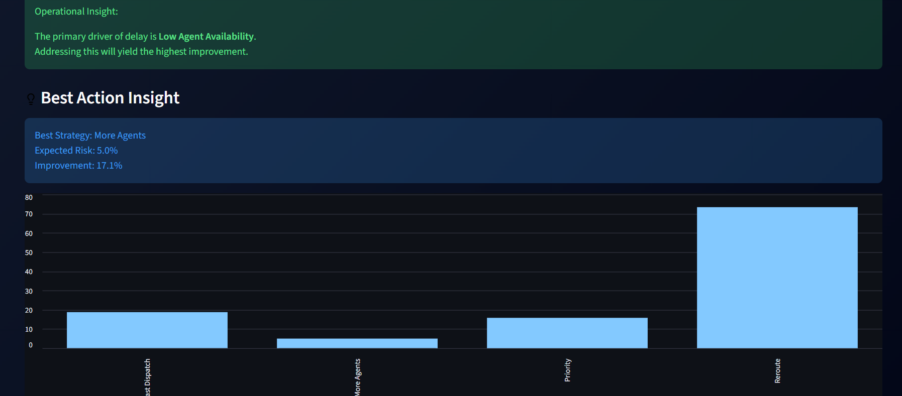
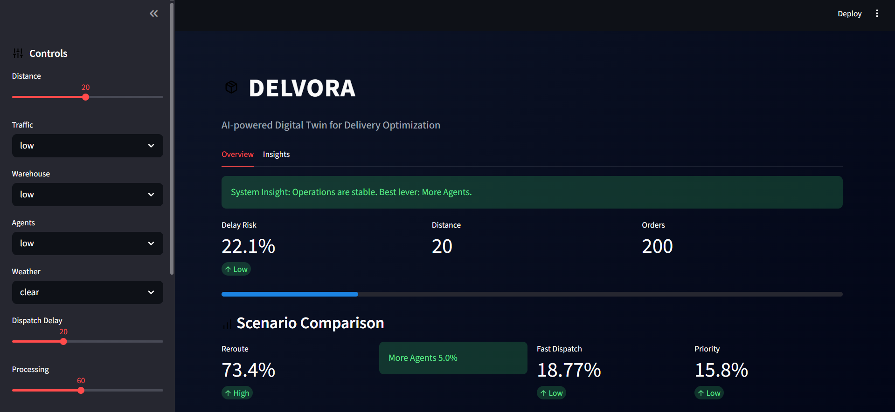
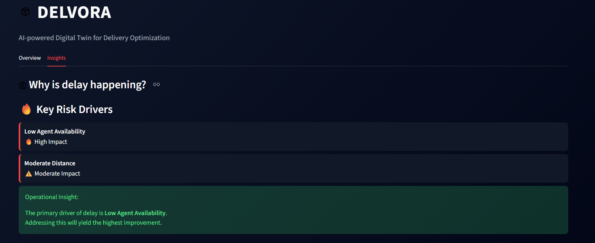

#  Delvora — AI-powered Digital Twin for Delivery Optimization

> **Simulate delivery conditions. Predict delays. Optimize decisions.**

---

##  What is Delvora?

**Delvora** is an AI-powered digital twin system designed to simulate real-world delivery environments and predict delay risks.

It enables logistics teams to test multiple operational scenarios (traffic, agent availability, dispatch delays) and take optimal decisions **before execution**.

---

##  Key Features

-  **Delay Risk Prediction** using Machine Learning  
-  **Scenario Simulation Engine**  
-  **Intelligent Decision Recommendations**  
-  **Explainable Insights** (why delays happen)  
-  **Best Action Suggestion**  
-  **Interactive Dashboard (Streamlit UI)**  

---

##  How it Works

1. Input delivery conditions (distance, traffic, agents, etc.)  
2. ML model predicts delay probability  
3. System simulates multiple scenarios  
4. Compares outcomes  
5. Recommends the best operational action  

---

##  Demo

---

## 🛠 Tech Stack

- **Python**
- **Pandas, NumPy**
- **Scikit-learn**
- **Streamlit**

---

##  Real-world Impact

Delvora can help:

- Reduce delivery delays  
- Improve logistics efficiency  
- Enable proactive decision-making  
- Optimize resource allocation (agents, routes, dispatch)  

---

## Run Locally

### Clone the repository

### Navigate to project folder
cd delvora

### Install dependencies
pip install -r requirements.txt

### Run the app
streamlit run app.py

##  Future Improvements

- Real-time data integration (APIs)  
- Advanced route optimization (Graph algorithms)  
- Deployment on cloud (Streamlit Cloud / AWS)  
- Reinforcement learning for dynamic decisions  

## Author
Jahnvee Srivastava

 If you like this project
Give it a ⭐ on GitHub!
